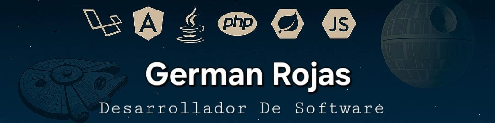

<div align="center">
  
</div>

<div align="center">

# ⚔️ Sherman97

### Software Developer · Full Stack Developer · Laravel · Angular · Spring Boot

> “The Force is strong with this code.”

</div>

---

## 🛸 About me

Soy desarrollador de software con más de **5 años de experiencia** en el diseño, desarrollo y soporte de soluciones tecnológicas para sectores como **ERP universitarios, plataformas de medios digitales, ticketing y sistemas hospitalarios**.

Tengo experiencia trabajando en proyectos **backend y frontend**, desarrollando nuevas funcionalidades, integrando APIs REST, optimizando consultas en bases de datos relacionales y mejorando el rendimiento de aplicaciones web.

Me gusta construir soluciones limpias, mantenibles y escalables, aplicando buenas prácticas de desarrollo, arquitectura limpia y metodologías orientadas a requerimientos.

- 🧠 Experiencia con **Laravel, Angular, Spring Boot, Symfony y Docker**
- ⚙️ Desarrollo de APIs REST, módulos empresariales y plataformas web
- 🧩 Interés en arquitectura limpia, microservicios y buenas prácticas
- 🌌 Fan de Star Wars y del lado oscuro del código
- 🚀 Siempre aprendiendo nuevas tecnologías

---

## ⚔️ Tech Stack

<div align="center">


</div>

---

## 🧩 Main Skills

```txt
Backend        Laravel · Spring Boot · Symfony · REST APIs
Frontend       Angular · React · PrimeNG · TailwindCSS · Bootstrap
Databases      PostgreSQL · MySQL · SQL Server
DevOps         Docker · Git · GitHub · GitLab · CI/CD basics
Cloud/APIs     Azure AD · Google Maps Platform · reCAPTCHA v2
Architecture   MVC · Clean Architecture · Hexagonal Architecture
Practices      Scrum · SDD · Technical documentation
